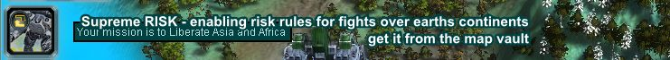

# Supreme Risk

Supreme Risk is a Map for Supreme Commander and Supreme Commander Forged Alliance Forever, enabling rules from the board game "RISK"

## History

I first wrote this Map back in 2007, and recently picked it up again to make it compatible with modern FA.

## How to Play
### Manual Installation

* Install the Forged Alliance Forever Multiplayer client http://faforever.com/ 
* You need a valid license of "Supreme Commander: Forged Alliance" (from steam of other sources)
* Copy the folder Supreme_Risk.v0010 to %USERPROFILE%\Documents\My Games\Gas Powered Games\Supreme Commander Forged Alliance\maps\Supreme_Risk.v0010

### Gameplay

* Gameplay is split into rounds (10 to 60 seconds depending on game settings) 
* Players can reinforce territories, defend and liberate neighbouring countries
* Standard Risk rules apply when determining victories, and new units to be placed

* Options available in the game settings
  * Choose tier of units to use (T1, T2, T3)
  * Lose or retain reinforcements
  * unit movement settings

## Files

- Supreme_Risk.v0010 The version compatible with FAF
- Supreme_Risk	The version compatible with Original SupCom from 2007 (no longer maintained)

## Known Issues/Bugs

- Please report bugs here on github or in the faf community forum https://forums.faforever.com/viewtopic.php?f=41&t=18368

## Links

- map editor logs: %APPDATA%\LocalLow\ozonexo3\FAF Map Editor
- map editor wiki: https://wiki.faforever.com/index.php?title=FA_Forever_Map_Editor#Custom_resources

- location of the map %USERPROFILE%\Documents\My Games\Gas Powered Games\Supreme Commander Forged Alliance\maps\Supreme_Risk.v0010

- cp -R '%USERPROFILE%\Documents\My Games\Gas Powered Games\Supreme Commander Forged Alliance\maps\Supreme_Risk.v0010' .

- Start for testing C:\ProgramData\FAForever\bin\ForgedAlliance.exe /init init_faf.lua /nobugreport /log "C:\ProgramData\FAForever\logs\game1.log" /EnableDiskWatch
